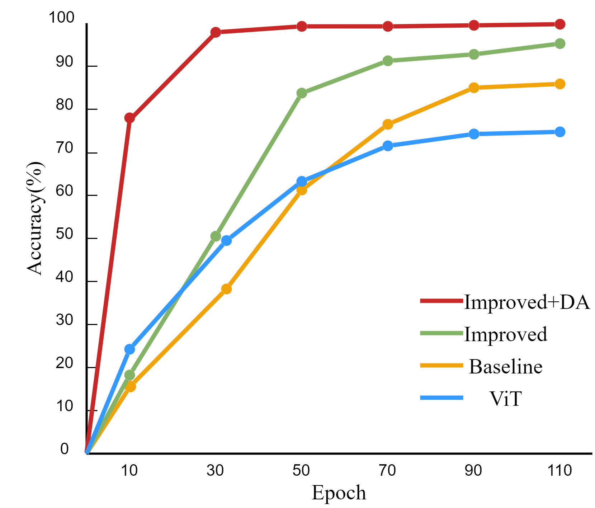
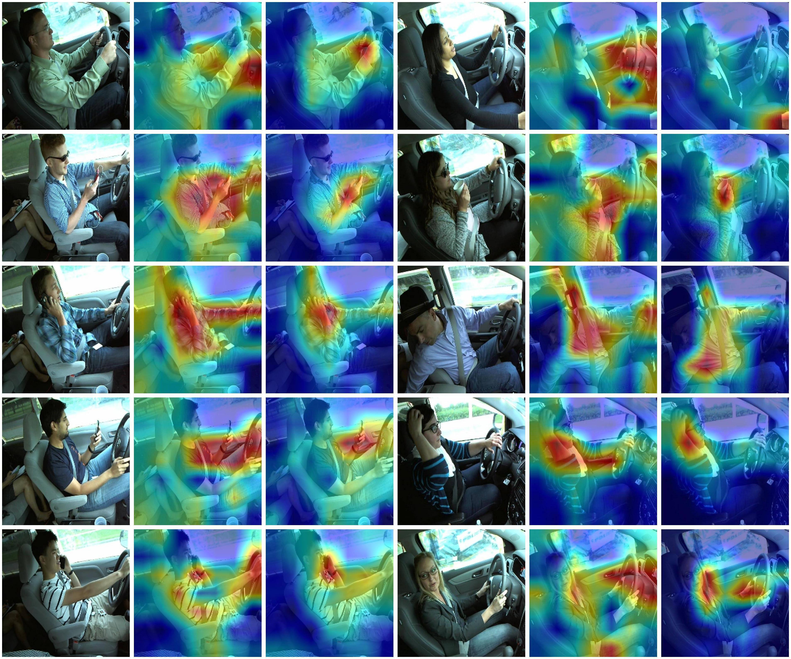

# SL-DDBD

### SL-DDBD: A Novel Driver Distraction Behavior Detection Based on Self-Supervised Learning Framework with Masked Image Modeling


## Introduction

In this work, we proposed a novel method for driver distraction behavior detection, termed as **SL-DDBD**. Self-supervised learning framework for masked image modeling. The structure-improved swin transformer was used as an encoder. Extended SF3 dataset using multiple methods of data augmentation strategies. Selected the best masking strategy.

More detailed can be found in our [arxiv](https://arxiv.org/ftp/arxiv/papers/2306/2306.00543.pdf) paper.

## Main Results

In this work, four models were compared for their performance over different epochs. Improved+DA exhibited the fastest convergence and the highest accuracy at each epoch, achieving 78% accuracy by the 10th epoch and a final accuracy of 99.60%. Conversely, the ViT model, despite fast convergence, only managed a final accuracy of 74.35%. The Improved model consistently surpassed the baseline, underscoring the benefits of optimization.

<div align="center">
    
</div>

To investigate the advancement of self-supervised learning based on masked image modeling, we visualize the self-supervised learning model and the supervised learning model.The self-supervised model's attention is focused on the key parts of the scene objects and has a better grasp of the feature information, avoiding the problem of feature redundancy and excessive computational costs.



### State Farm Pre-trained Model

| name | pre-train epochs | pre-train resolution | fine-tune resolution | acc@1 | pre-trained model |
| :---: | :---: | :---: | :---: | :---: | :---: |
| SLDDBD-Base | 110 | 224x224 | 224x224 | 84.92 | [google](https://drive.google.com/file/d/1Cy7XrFERX-2W6I9hS7r2WGZoiG0b3e49/view?usp=sharing)/[config](configs/SLDDBD_patchsize32_swin_ratio0.5_img224_statefarm_110ep.yaml) | 

### ImageNet-1K Pre-trained Model

| name | pre-train epochs | pre-train resolution | fine-tune resolution | acc@1 | pre-trained model |
| :---: | :---: | :---: | :---: | :---: | :---: |
| SwinMIM-Large | 800 | 224x224 | 224x224 | 85.4 | [google](https://drive.google.com/file/d/1DCELfGormJK0xbMU2A-mvBWZStSbDUfd/view?usp=sharing)/[config](configs/MIM_finetune__swin_large__img224_window14__800ep.yaml) | 
## Installation

 The requirements are listed in the `requirement.txt` file. To create your own environment, an example is:

```bash
pip install -r requirement.txt
cd apex
pip install -v --disable-pip-version-check --no-cache-dir ./
cd ..
export MASTER_ADDR=localhost
export MASTER_PORT=5678
```

## Train

 The training continues by using a pretrained model from our work, an example is:

```bash
python main.py  --cfg configs/SLDDBD_patchsize32_swin_ratio0.5_img224_statefarm_110ep.yaml --pretrained SLDDBD_patchsize32_swin_ratio0.5_img224_statefarm_110ep.pth --data-path dataset --local_rank 0 --batch-size 32
```
 New training using the MIM pretrained model:, an example is:

```bash
python main.py  --cfg configs/MIM_finetune__swin_large__img224_window14__800ep.yaml --pretrained MIM_finetune__swin_large__img224_window14__800ep.pth --data-path dataset --local_rank 0 --batch-size 32
```


## Evaluation

The evaluation configurations can be adjusted at `main_eval.py`.
Get the confusion matrix results you need in the confusion matrix folder.

```bash
cd eval
python main_eval.py --eval  --cfg configs/SLDDBD_patchsize32_swin_ratio0.5_img224_statefarm_110ep.yaml  --resume ./SLDDBD_patchsize32_swin_ratio0.5_img224_statefarm_110ep.pth --local_rank 0 --data-path  dataset
```

## Inference

Print the detection results of the weights model and output the txt file.


```bash
cd eval
python inference.py --cfg configs/SLDDBD_patchsize32_swin_ratio0.5_img224_statefarm_110ep.yaml  --resume ./SLDDBD_patchsize32_swin_ratio0.5_img224_statefarm_110ep.pth --local_rank 0
```
You can modify the inference code to customize the inference categories and data input path.

### Citation

If you are interested in this work, please cite the following work:

```
@article{zhang2023novel,
  title={A Novel Driver Distraction Behavior Detection Based on Self-Supervised Learning Framework with Masked Image Modeling},
  author={Zhang, Yingzhi and Li, Taiguo and Li, Chao and Zhou, Xinghong},
  journal={arXiv preprint arXiv:2306.00543},
  year={2023}
}
```

### Acknowledgments

Our work is based on [Swin Transformer](https://github.com/microsoft/Swin-Transformer) and we use their code.  We appreciate the previous open-source repository [Swin Transformer](https://github.com/microsoft/Swin-Transformer).

